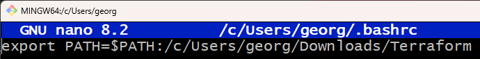
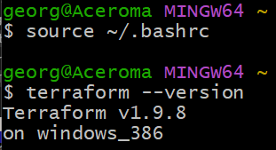
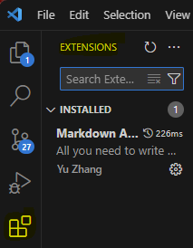
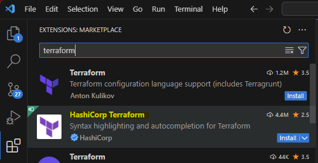

# Download Terraform
* Download from internet.
* Un-zip file and place where you will remember, i.e., user/georg/Downloads/terraform
* `nano ~/.bashrc`
* add the terraform path: `export PATH=$PATH:/c/Users/georg/Downloads/Terraform`
* 

* Reload the .bashrc File: `source ~/.bashrc`

## Add Terraform Extension to VSCode
* Open Visual Studio Code.
* Go to the Extensions view by clicking on the Extensions icon in the Activity Bar on the side of the window.
* Search for “Terraform” and install the official extension by HashiCorp.
  * Add the Terraform extension/plugin (official one by Hashicorp) to VSCode.

 

# Create new repo: tech264-terraform

 

# Research Terraform

 

# Tuesday Code-Along