# Terraform

- [Terraform](#terraform)
- [Download Terraform](#download-terraform)
  - [Add Terraform Extension to VSCode](#add-terraform-extension-to-vscode)
- [Create new repo: tech264-terraform](#create-new-repo-tech264-terraform)
- [Research Terraform](#research-terraform)
  - [What is Terraform? What is it used for?](#what-is-terraform-what-is-it-used-for)
  - [Why use Terraform? The benefits?](#why-use-terraform-the-benefits)
  - [Alternatives to Terraform](#alternatives-to-terraform)
  - [Who is using Terraform in the industry?](#who-is-using-terraform-in-the-industry)
  - [In IaC, what is orchestration? How does Terraform act as an "orchestrator"?](#in-iac-what-is-orchestration-how-does-terraform-act-as-an-orchestrator)
  - [Best practice for supplying AWS credentials to Terraform](#best-practice-for-supplying-aws-credentials-to-terraform)
  - [Order in which Terraform looks up AWS credentials](#order-in-which-terraform-looks-up-aws-credentials)
  - [What is the best practice to supply AWS credentials?](#what-is-the-best-practice-to-supply-aws-credentials)
  - [How AWS credentials should never be passed to Terraform:](#how-aws-credentials-should-never-be-passed-to-terraform)
  - [Why use Terraform for different environments (e.g. production, testing, etc.)?](#why-use-terraform-for-different-environments-eg-production-testing-etc)
- [Setup environment variables to supply values of AWS access keys](#setup-environment-variables-to-supply-values-of-aws-access-keys)
  - [Test you can access the values set above](#test-you-can-access-the-values-set-above)

# Download Terraform
* Download from internet.

Source: https://developer.hashicorp.com/terraform/install
* Un-zip Terraform file and move it to a location you will remember so you can copy the path later on. 
  * e.g., Program files > my-cmd-line-tools > terraform.
* Put it into windows environment variables. 

  * Windows Search Terminal > Control Panel > System and Security > System > Advanced System Settings. 

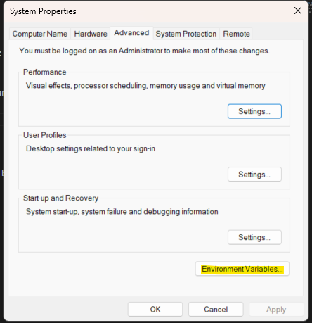

* Click "Environment Variables"
* Click "Path"
* Click "Add"
* Click "New"
* Paste the path to your "terraform" folder (make sure you're in the folder). 

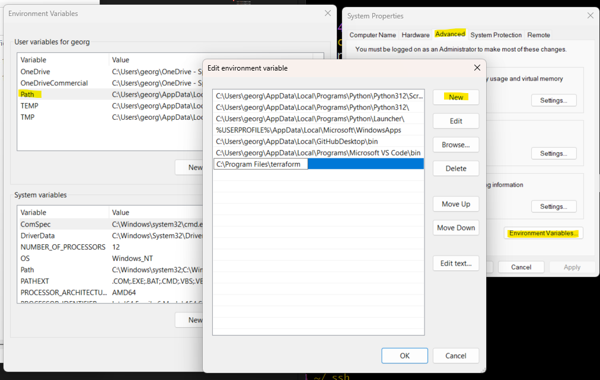

* You should be able to access terraform anywhere in your GitBash window. 
* Use the command `terraform --version` to check if it's working. 

 

## Add Terraform Extension to VSCode
* Open Visual Studio Code.
* Go to the Extensions view by clicking on the Extensions icon in the Activity Bar on the side of the window.
* Search for “Terraform” and install the official extension by HashiCorp.
  * Add the Terraform extension/plugin (official one by Hashicorp) to VSCode.

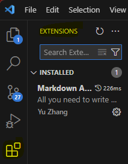

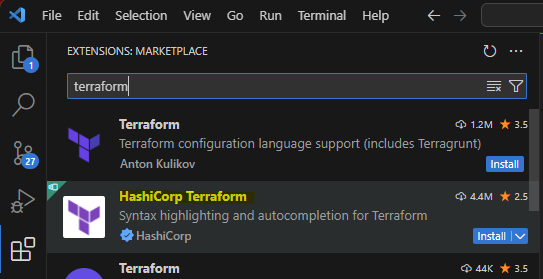

 

# Create new repo: tech264-terraform
On GitHub, create a new repo called 'tech264-terraform'.

1. cd path/to/your/project 
2. git init  (If it's a new project).
3. `git remote add origin` https://github.com/your-username/your-repo.git (Link to GitHub repo).
4. `git add` README.md (Add the specific file). 
5. `git commit -m` "Add myfile.txt"
6. `git push -u origin main`  (First push). 

  

# Research Terraform
## What is Terraform? What is it used for?
* Terraform is an `open-source Infrastructure as Code` (IaC) `tool` created by HashiCorp. 
* It allows you to `define` and `manage` `cloud infrastructure `using a `declarative configuration language` (HCL - HashiCorp Configuration Language). 
* Terraform is used for `provisioning` and `managing resources` like servers, databases, networking, and more, across various cloud platforms such as AWS, Azure, Google Cloud, and others.

## Why use Terraform? The benefits?
* ☁️**Multi-Cloud Support**☁️: Terraform can manage infrastructure on multiple cloud platforms, which gives flexibility and avoids vendor lock-in.
* 📜**Declaration**📜: You define what you want, and Terraform figures out how to create or update your infrastructure.
* 🏗️**Infrastructure as Code**🏢 (IaC): Terraform makes it easier to version control, audit, and track changes in your infrastructure just like software code.
* 🏧**Automation**🏧: It simplifies infrastructure provisioning and automates changes without manual intervention.
* 🧑🏻‍💼**State Management**👨🏻‍💼: Terraform maintains a state file that keeps track of your infrastructure, ensuring smooth updates and rollbacks.

## Alternatives to Terraform
* **AWS CloudFormation**: A service specifically for provisioning AWS resources. 
* **Pulumi**: Another Infrastructure as Code tool that uses general-purpose programming languages.
* **Ansible**: A tool focused on configuration management but can also provision infrastructure.
* **Chef and Puppet**: Traditionally used for configuration management but also support provisioning infrastructure.

 

## Who is using Terraform in the industry?
Many companies and organisations, both large and small, use Terraform, including:

* Airbnb
* Uber
* Slack
* Datadog
* Atlassian
* Spotify

Terraform is commonly used across industries like tech, finance, healthcare, and government for managing cloud infrastructure.

 

## In IaC, what is orchestration? How does Terraform act as an "orchestrator"?
Orchestration in IaC refers to the process of `coordinating multiple resources and their dependencies`.

* Terraform acts as an orchestrator by `managing the lifecycle of infrastructure resources` (create, update, and delete) and ensuring that the `correct order of operations happens` based on dependencies between resources. 
  * For example, if a database server depends on a networking setup, Terraform ensures the network is created before the server is provisioned.

 

## Best practice for supplying AWS credentials to Terraform
AWS credentials allow Terraform to `authenticate and interact with AWS resources`. Best practices include:

* **Use IAM Roles** (especially with EC2 instances): Instead of using static credentials, assign an IAM role to the EC2 instance that Terraform runs on. 
  * Terraform can then assume that role for AWS access, which is more secure.

* **Environment Variables**: Set AWS credentials using environment variables (AWS_ACCESS_KEY_ID and AWS_SECRET_ACCESS_KEY), but avoid hardcoding them in scripts or configuration files.

* **AWS CLI or SDK credentials file**: Use the `~/.aws/`credentials file, which stores AWS credentials locally in a secure way.

* **Credential helper programs**: Use AWS Single Sign-On (SSO) or AWS Vault to manage and inject credentials securely.

* **Temporary credentials via assumed roles**: For long-lived processes, use temporary credentials (STS tokens) to reduce the risk of exposure.

 

## Order in which Terraform looks up AWS credentials
Terraform looks for AWS credentials in the following order:

1. **Static credentials via environment variables**: AWS_ACCESS_KEY_ID, AWS_SECRET_ACCESS_KEY, and optionally AWS_SESSION_TOKEN.
2. **AWS credentials file**: ~/.aws/credentials or ~/.aws/config.
3. **Instance profile credentials**: If running on an AWS EC2 instance, Terraform will use the IAM role attached to that instance.
4. **Custom credential provider chains**: You can configure Terraform to use specific credentials provider chains or plugins.

 

## What is the best practice to supply AWS credentials?
The best practice is to `avoid hardcoding credentials` into your codebase. Instead, use:

* **IAM roles**: Especially for EC2 instances or other AWS resources.
* **Environment variables**: In combination with secure systems like AWS Secrets Manager or HashiCorp Vault.
* **AWS SSO or AWS CLI profiles**: If you are managing multiple environments.

 

## How AWS credentials should never be passed to Terraform:
* Never hardcode credentials in Terraform configuration files (.tf files).
* Avoid committing credentials into version control (e.g., GitHub).

 

## Why use Terraform for different environments (e.g. production, testing, etc.)?
Terraform is ideal for managing multiple environments because:

* **Separation of Concerns**: You can define different state files and configurations for each environment (production, testing, etc.), ensuring that changes in one environment do not affect others.

* **Consistency**: Using the same infrastructure code across environments ensures consistent deployment and reduces the chances of configuration drift.

* **Automation**: Terraform makes it easy to spin up environments quickly, which is especially useful for testing or staging environments.

* **Workspaces and Modules**: Terraform provides workspaces and modules that help manage separate environments in a scalable and organised way.

 

# Setup environment variables to supply values of AWS access keys
* Setup environment variables to store the AWS access keys
  * access key ID.
  * Secret access key.

Terraform needs access. It'll look them up so it has to have a particular name. 

Name of env var: AWS_ACCESS_KEY_ID Value: get it from the csv file sent to you.
Name of env var: AWS_SECRET_ACCESS_KEY Value: get it from the csv file sent to you.

* Windows Search Bar > Edit system environment variables.

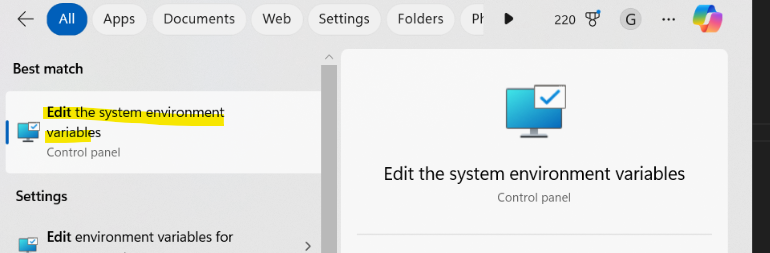

* Advanced > Environment Variables.

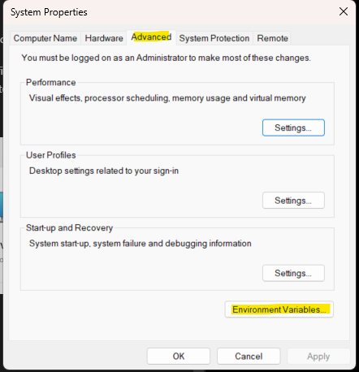 

* Windows users should use system variables, rather than user variables.
  * Git Bash will access system variables, but not user variables.

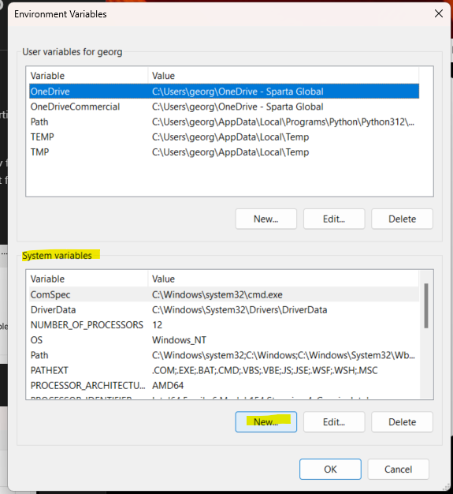

* Click "New" on System Variables. 
  * We will be doing this twice for:
    * AWS_ACCESS_KEY_ID 
    * AWS_SECRET_ACCESS_KEY
* Put in the correct credentials that Ramon sent for your 'accesskeys'.

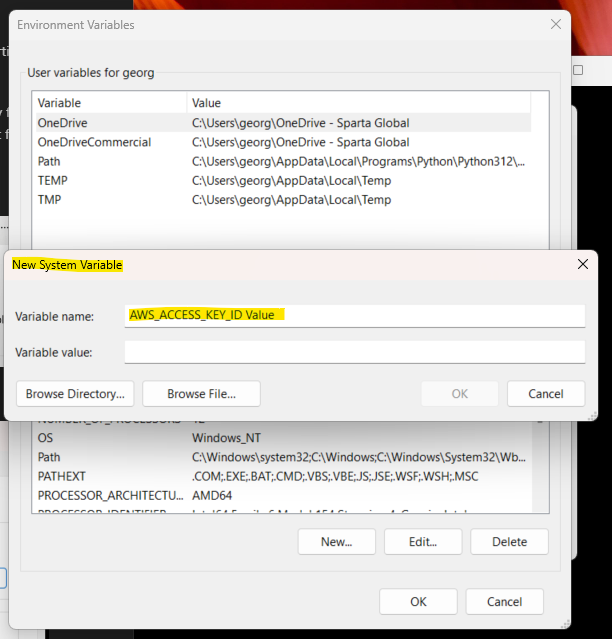
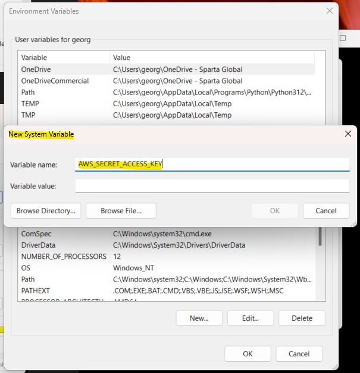

* Submit both keys and you should see them in your system variables. 
* Make sure you click "OK" to save your variables. 

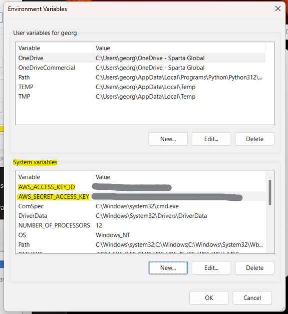

  

## Test you can access the values set above
* Open a new Git Bash window to load the latest env var.
* Windows users, use command env to check the env var.

* Make sure you're in the home directory '`/`'.
* `env` just to make sure you can see your environmental variables. 
* `env | grep AWS`: this is to filter the variables to search for your 'AWS' variable. 

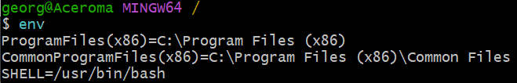
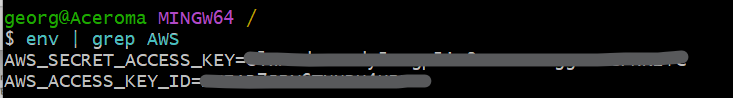

 

