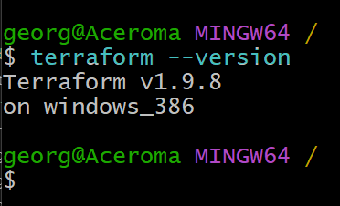

# Terraform

- [Terraform](#terraform)
- [Research Terraform](#research-terraform)
  - [What is Terraform? What is it used for?](#what-is-terraform-what-is-it-used-for)
    - [Key Benefits of HCL](#key-benefits-of-hcl)
  - [Why use Terraform? The benefits?](#why-use-terraform-the-benefits)
  - [Alternatives to Terraform](#alternatives-to-terraform)
  - [Who is using Terraform in the industry?](#who-is-using-terraform-in-the-industry)
  - [In IaC, what is orchestration? How does Terraform act as an "orchestrator"?](#in-iac-what-is-orchestration-how-does-terraform-act-as-an-orchestrator)
  - [Best practice for supplying AWS credentials to Terraform](#best-practice-for-supplying-aws-credentials-to-terraform)
  - [Order in which Terraform looks up AWS credentials](#order-in-which-terraform-looks-up-aws-credentials)
  - [What is the best practice to supply AWS credentials?](#what-is-the-best-practice-to-supply-aws-credentials)
  - [How AWS credentials should never be passed to Terraform:](#how-aws-credentials-should-never-be-passed-to-terraform)
  - [Why use Terraform for different environments (e.g. production, testing, etc.)?](#why-use-terraform-for-different-environments-eg-production-testing-etc)
    - [Benefits](#benefits)
- [Download Terraform](#download-terraform)
  - [Add Terraform Extension to VSCode](#add-terraform-extension-to-vscode)
- [Create new repo: tech264-terraform](#create-new-repo-tech264-terraform)
- [Setup environment variables to supply values of AWS access keys](#setup-environment-variables-to-supply-values-of-aws-access-keys)
  - [Test you can access the values set above](#test-you-can-access-the-values-set-above)
- [How Terraform Works](#how-terraform-works)
  - [Ramon's Diagram](#ramons-diagram)
  - [Destructive Commands: apply \& destroy](#destructive-commands-apply--destroy)
- [Setup .gitignore file](#setup-gitignore-file)
  - [Code-Along](#code-along)
  - [Writing Terraform Code](#writing-terraform-code)
- [Research](#research)
  - [What is pull and push configuration management (IaC)?](#what-is-pull-and-push-configuration-management-iac)
    - [Pull configuration management](#pull-configuration-management)
    - [Push configuration management](#push-configuration-management)
  - [What is pull and push configuration management (IaC)?](#what-is-pull-and-push-configuration-management-iac-1)
    - [Pull configuration management](#pull-configuration-management-1)
    - [Push configuration management](#push-configuration-management-1)
  - [Which tools support push/pull?](#which-tools-support-pushpull)
    - [Pull-based tools](#pull-based-tools)
    - [Push-based tools](#push-based-tools)
  - [Does Terraform use the push or pull configuration?](#does-terraform-use-the-push-or-pull-configuration)
  - [Which is better: push or pull configuration management?](#which-is-better-push-or-pull-configuration-management)
    - [Push model](#push-model)
    - [Pull model](#pull-model)

# Research Terraform
## What is Terraform? What is it used for?
* Terraform is an `open-source Infrastructure as Code` (IaC) `tool` created by HashiCorp. 
  * It allows you to `define` and `manage` `cloud infrastructure `using a `declarative configuration language` (HCL - HashiCorp Configuration Language). 
* Terraform is used to `create` and `manage resources` on different cloud platforms like AWS, Azure, and Google Cloud.
  * It makes it easier to handle things like servers, databases, and networks by writing simple code instead of doing everything manually.
  * It can also deploy and destroy (if we don't need it anymore).
  * It sees infrastructure as imutable. 
* Primarily used for orchestration. 
  * Orchestration tools help you **manage** and **automate** the **setup and coordination** of your IT **infrastructure**. 

  
> Think of them as the conductors of an orchestra, making sure all the different parts (like servers, databases, and networks) work together smoothly.

<br>

### Key Benefits of HCL
* **Human-Readable**
  * HCL is designed to be easy to read and write, even for those who are not developers. 
  * Its syntax is similar to JSON but more user-friendly, making it accessible to a wider audience.

* **Declarative Language**
  * HCL is declarative, meaning you describe the desired state of your infrastructure, and the tool (like Terraform) takes care of achieving that state. 
  * This simplifies the process of managing infrastructure.

* **Modularity**
  * HCL supports modularity, allowing you to break down your infrastructure code into reusable components. 
  * This makes it easier to manage large and complex configurations.

* **Extensibility**
  * HCL is highly extensible, allowing you to define custom modules and providers. 
  * This flexibility makes it suitable for a wide range of use cases and environments.

* **Integration with Terraform**
  * HCL is the native language for Terraform, one of the most popular Infrastructure as Code (IaC) tools. 
  * This tight integration ensures that you can leverage all of Terraform’s features and capabilities.

* **Version Control**
  * Because HCL is text-based, it can be easily version-controlled using tools like Git. 
  * This allows you to track changes, collaborate with others, and roll back to previous configurations if needed.

* **Error Handling and Validation**
  * HCL includes built-in error handling and validation, helping you catch mistakes early and ensure that your configurations are correct before applying them.


<br> 

## Why use Terraform? The benefits?
* 👐🏻**Open-source**📂: Lisencing has changed.
  * Can still be used for free, even comercially. 
  * You may owe money if you create something profitable, competing products to Terraform. 
    * As a result, Terraform cannot be used to create a competing product. If you do, you will be charged. 

* 🙂**Easy to use**☮️

* ☁️**Multi-Cloud Support**☁️: Terraform can manage infrastructure on multiple cloud platforms, which gives flexibility and avoids vendor lock-in.
  * *Cloud Agnostic*: You can deploy to any cloud using the same tool because it uses different providers. 
    * E.g., Azure is supported with Terraform becuase it's a provider you've defined. Each provider maintains their own plugins that are downloaded/associated with that provider. 
  * Compatiple with many cloud providers. 

* 📜**Declaration**📜: You define what you want, and Terraform figures out how to create or update your infrastructure.
  * *Declarative language*: declare what you want, NOT how to do it. 
  * Terraform takes care of how to do it. 

* 🏗️**Infrastructure as Code**🏢 (IaC): Terraform makes it easier to version control, audit, and track changes in your infrastructure just like software code.

* 🏧**Automation**🏧: It simplifies infrastructure provisioning and automates changes without manual intervention.

* 🧑🏻‍💼**State Management**👨🏻‍💼: Terraform maintains a state file that keeps track of your infrastructure, ensuring smooth updates and rollbacks.

## Alternatives to Terraform
* **AWS CloudFormation**: A service specifically for provisioning AWS resources. 
* **Pulumi**: Another Infrastructure as Code tool that uses general-purpose programming languages.
* **Ansible**: A tool focused on configuration management but can also provision infrastructure.
* **Chef and Puppet**: Traditionally used for configuration management but also support provisioning infrastructure.


<br>

## Who is using Terraform in the industry?
Many companies and organisations, both large and small, use Terraform, including:

* Airbnb
* Uber
* Slack
* Datadog
* Atlassian
* Spotify

Terraform is commonly used across industries like tech, finance, healthcare, and government for managing cloud infrastructure.


<br>

## In IaC, what is orchestration? How does Terraform act as an "orchestrator"?
Orchestration in IaC refers to the process of `coordinating multiple resources and their dependencies`.

* Terraform acts as an orchestrator by `managing the lifecycle of infrastructure resources` (create, update, and delete) and ensuring that the `correct order of operations happens` based on dependencies between resources. 
  * For example, if a database server depends on a networking setup, Terraform ensures the network is created before the server is provisioned.

<br>

## Best practice for supplying AWS credentials to Terraform
AWS credentials allow Terraform to `authenticate and interact with AWS resources`. 

* **Use IAM Roles** (especially with EC2 instances): Instead of using static credentials, assign an IAM role to the EC2 instance that Terraform runs on. 
  * Terraform can then assume that role for AWS access, which is more secure.
  * Safest way.

* **Environment Variables**: Set AWS credentials using environment variables (AWS_ACCESS_KEY_ID and AWS_SECRET_ACCESS_KEY), but avoid hardcoding them in scripts or configuration files.
  * For local development. 

* **AWS CLI or SDK credentials file**: Use the `~/.aws/`credentials file, which stores AWS credentials locally in a secure way.

* **Credential helper programs**: Use AWS Single Sign-On (SSO) or AWS Vault to manage and inject credentials securely.

* **Temporary credentials via assumed roles**: For long-lived processes, use temporary credentials (STS tokens) to reduce the risk of exposure.

<br>

## Order in which Terraform looks up AWS credentials
Terraform looks for AWS credentials in the following order:

1. **Static credentials via environment variables**: AWS_ACCESS_KEY_ID, AWS_SECRET_ACCESS_KEY, and optionally AWS_SESSION_TOKEN.
2. **AWS credentials file**: ~/.aws/credentials or ~/.aws/config.
3. **Instance profile credentials**: If running on an AWS EC2 instance, Terraform will use the IAM role attached to that instance.
4. **Custom credential provider chains**: You can configure Terraform to use specific credentials provider chains or plugins.

<br>

## What is the best practice to supply AWS credentials? 
The best practice is to `avoid hardcoding credentials` into your codebase. Instead, use:

* **IAM roles**: Especially for EC2 instances or other AWS resources.
* **Environment variables**: In combination with secure systems like AWS Secrets Manager or HashiCorp Vault.
* **AWS SSO or AWS CLI profiles**: If you are managing multiple environments.

<br>

## How AWS credentials should never be passed to Terraform:
* Never hardcode credentials in Terraform configuration files (.tf files).
* Avoid committing credentials into version control (e.g., GitHub).
  * Including sensitive data in configuration files in s a major security risk, as it can caccidently be commited to version control. 
 

<br>

## Why use Terraform for different environments (e.g. production, testing, etc.)?
* Terraform makes it easy to manage multiple environments (like production, testing, and development) by allowing you to reuse the same infrastructure definitions with different configurations. 

### Benefits
Terraform is ideal for managing multiple environments because:

* **Separation of Concerns**: You can define different state files and configurations for each environment (production, testing, etc.), ensuring that changes in one environment do not affect others.

* **Consistency**: Using the same infrastructure code across environments ensures consistent deployment and reduces the chances of configuration drift.
  * Most of, if not all, the depencencies should match.
  * e.g., environment variables across the team are the same. 
  * e.g., testing can be carried out in a consistent environment with matching dependencies to ensure that the tests in the **QA** environment run in the same in the production environment, testing resources can be easily disposed of when the tests are no longer necessary, **PROD** should only differ in scalability.

* **Automation**: Terraform makes it easy to spin up environments quickly, which is especially useful for testing or staging environments.

* **Workspaces and Modules**: Terraform provides workspaces and modules that help manage separate environments in a scalable and organised way.

* **Version Control**: Track infrastructure changes in different environments with version control, which adds traceability and accountability.


<br>

# Download Terraform
* Download from internet.


Source: https://developer.hashicorp.com/terraform/install
* Un-zip Terraform file and move it to a location you will remember so you can copy the path later on. 
  * e.g., Program files > my-cmd-line-tools > terraform.
* You can change the environment variables through windows system properties. 

  * Windows Search Terminal > Control Panel > System and Security > System > Advanced System Settings. 

> You can also find your way by searching "Edit system environment variables." in your Windows search bar. 


* Click "Environment Variables"
* Click "Path"
* Click "Add"
* Click "New"
* Paste the path to your "terraform" folder (make sure you're in the folder). 


* You should be able to access terraform anywhere in your GitBash window. 
* Use the command `terraform --version` to check if it's working. 



<br>

## Add Terraform Extension to VSCode
* Open Visual Studio Code.
* Go to the Extensions view by clicking on the Extensions icon in the Activity Bar on the side of the window.
* Search for “Terraform” and install the official extension by HashiCorp.
  * Add the Terraform extension/plugin (official one by Hashicorp) to VSCode.


<br>

# Create new repo: tech264-terraform
On GitHub, create a new repo called 'tech264-terraform'.

1. cd path/to/your/project 
2. git init  (If it's a new project).
3. `git remote add origin` https://github.com/your-username/your-repo.git (Link to GitHub repo).
4. `git add` README.md (Add the specific file). 
5. `git commit -m` "Add myfile.txt"
6. `git push -u origin main`  (First push). 

<br> 

# Setup environment variables to supply values of AWS access keys
* Setup environment variables to store the AWS access keys
  * access key ID.
  * Secret access key.

Terraform needs access. It'll look them up so it has to have a particular name. 

Name of env var: AWS_ACCESS_KEY_ID Value: get it from the csv file sent to you.
Name of env var: AWS_SECRET_ACCESS_KEY Value: get it from the csv file sent to you.

* Windows Search Bar > Edit system environment variables.


* Advanced > Environment Variables.

 

* Windows users should use system variables, rather than user variables.
  * Git Bash will access system variables, but not user variables.


* Click "New" on System Variables. 
  * We will be doing this twice for:
    * AWS_ACCESS_KEY_ID 
    * AWS_SECRET_ACCESS_KEY
* Put in the correct credentials that Ramon sent for your 'accesskeys'.


* Submit both keys and you should see them in your system variables. 
* Make sure you click "OK" to save your variables. 


<br> 

## Test you can access the values set above
* Open a new Git Bash window to load the latest env var.
* Windows users, use command env to check the env var.

* Make sure you're in the home directory '`/`'.
* `env` just to make sure you can see your environmental variables. 
* `env | grep AWS`: this is to filter the variables to search for your 'AWS' variable. 


<br>

# How Terraform Works
## Ramon's Diagram


> Swap for your own understanding.

* We're on our local machine (local host).
* On our local machines, we have installed Terraform.
* Terraform is going to need code. 
  * The usual way to start things off is in a Terraform code file: `main.tf`. 
* `module`: all the Terraform code that's stored in a folder. You need to keep all of the files in the same folder, Terraform won't look in sub-folders.
  * All tf code in a folder. 
  * Inside this folder we will have a `main.tf`.
  * Terraform will look at all this code together to know what to do.

* With all this on our local machine, we need to run four commands for the usual workflow.
  * Terraform workflow: `terraform init`: terraform is going to go into your code and look at what providers you've specified that you need. 
    * It will then download the plugin it thinks it needs. 
  * `terraform plan`: it will generate a plan of what it needs to do to get things into the state that you've defined in your files. 
    * It's showing you the plan of how to achieve what you want as you're defining your code. 
  * `terraform apply`: this can carry out the plan you've previously come up with. (if you say 'yes').
    * You can use this command to save the plan. And then later specify that you want this plan executed. 
    * This is called a **destructive command** because it will go and create, moduify, or destroy things to be able to carry out the plan. 
  * `terraform destroy`: this will get rid of everything you've defined in the code. 

> `terraform fmt` (for format): this will just re-format your code to the way Terraform likes it. I.e., fixes indenting. 

## Destructive Commands: apply & destroy
* They are going to go out and talk to different cloud providers, e.g., AWS, GCP, Azure, and so on. 
* It will need the credentials to pass in order to make those changes, (we have already provided them to Terraform)

<br>

# Setup .gitignore file
* Terraform keeps track of the State, saves it as it knows it after its done its commands, those **State files** contain sensitive information such as credentials used to create that state.
* You need to know AT ALL TIMES where your Terraform commands are running from. 

## Code-Along
* We're doing this on Visual Studio Code within the tech264-terraform repo. 
* Right click on the folder > make a new file > ".gitignore". 
  * Go into that file.
* `.terraform/`: this is us telling it to ignore the file. 
* For more details, plese visit .gitignore file. 

<br>

## Writing Terraform Code
For reference, see main.tf file. 
* create an EC2 instance.
  * Where to create - provide the provider.
  * which region to use to create infrastructure
  * which service/resources to create.
  * which AMI ID ami-0c1c30571d2dae5c9 (for ubuntu 22.04 lts).
  * what type of instance to lauch -t2.micro.
  * add a public IP to this instance. 
  * give a name to the service/resource we create

```bash
# aws_access_key= xxxx MUST NEVER DO THIS  
# aws_secret_key = xxx MUST NEVER DO THIS
# syntax often used in HCL is key = value

# create an EC2 instance.
# Where to create - provide the provider.

provider "aws" {
  # which region to use to create infrastructure
  region = "eu-west-1"
}

# which service/resources to create.

resource "aws_instance" "app_instance" {
  # which AMI ID ami-0c1c30571d2dae5c9 (for ubuntu 22.04 lts)).
  ami = "ami-0c1c30571d2dae5c9"

  # what type of instance to lauch -t2.micro.
  instance_type = "t2.micro"

  # add a public IP to this instance. 
  associate_public_ip_address = true

  # give a name to the service/resource we create
  tags = {
    Name = "tech264-georgia-tf-app-instance"
  }

}
```

<br>

# Research
## What is pull and push configuration management (IaC)?
### Pull configuration management 
* In a pull model, each target machine (like a server) **pulls** its **configuration from a central server or management system**. 
* This happens periodically, where the machines use an **agent** to **check and update** their own configurations as needed. 
* This method is common in continuous management where machines need to **stay up-to-date** with the latest policies and configurations.

* Example: Puppet and Chef use this approach. 
  * **Agents** installed on machines **reach out to a central server** to **fetch** their latest **configurations**.

### Push configuration management 
* In a push model, the # Research
## What is pull and push configuration management (IaC)?
### Pull configuration management 
* In a pull model, each target machine (like a server) pulls its configuration from a central server or management system. 
* This happens periodically, where the machines use an agent to check and update their own configurations as needed. 
* This method is common in continuous management where machines need to stay up-to-date with the latest policies and configurations.

* Example: Puppet and Chef use this approach. Agents installed on machines reach out to a central server to fetch their latest configurations.

### Push configuration management 
* In a push model, the controlling server **pushes configurations directly to the target machines**. 
* This is usually done over a connection like **SSH** and **does not require an agent** running on the target machines. 
* This method is more **direct** and is often used when you need to **apply changes immediately**.

* Example: Ansible, Terraform, and AWS CloudFormation use this approach. 
  * The controlling system (like a laptop running Terraform) **pushes the infrastructure changes** to the target cloud providers or servers.

<br>

## Which tools support push/pull?
### Pull-based tools
* **Puppet and Chef**: Both use agents on machines that pull configurations periodically from a central server.

### Push-based tools
* **Ansible**: Pushes changes directly from the controlling machine to the targets over **SSH**.
* **Terraform**: Pushes changes to cloud infrastructure via **API calls**, making it more declarative but push-based.
* **AWS CloudFormation**: Also uses a push model when managing AWS infrastructure.

<br>

## Does Terraform use the push or pull configuration?
* Terraform uses the **push** model. 
* It **defines the desired state** of infrastructure in code and then **pushes the configuration** changes to cloud providers like AWS using their APIs. 
* This means it **does not require an agent** on the target systems, but rather **directly interacts with APIs** to apply the changes​ PUPPETEERS.


## Which is better: push or pull configuration management?
There’s no definitive "better" model—it depends on the use case.

<br>

### Push model 
* Is typically better for **provisioning infrastructure** and when you need **immediate application of changes**. 
* Tools like Terraform or Ansible excel in this for cloud infrastructure or one-time setups.

### Pull model 
* Is often better for **continuous configuration management**, where systems need to **regularly check in** and **stay updated** with the latest configurations. 
* Tools like Puppet and Chef are ideal for this.

> If you need ongoing, regular configuration updates, **pull** tools might be a better fit.
> 
> If you need to set up infrastructure or apply changes instantly, **push** tools are often more efficient​. 
