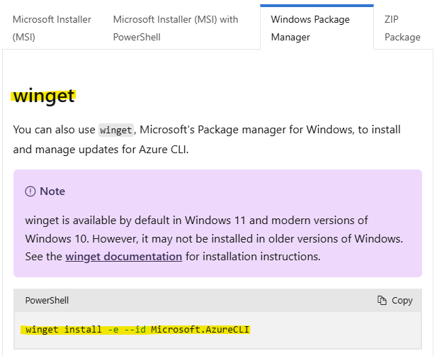
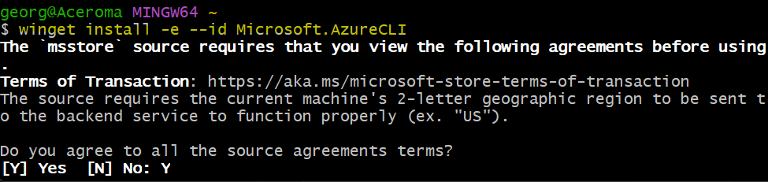
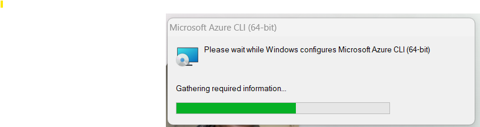
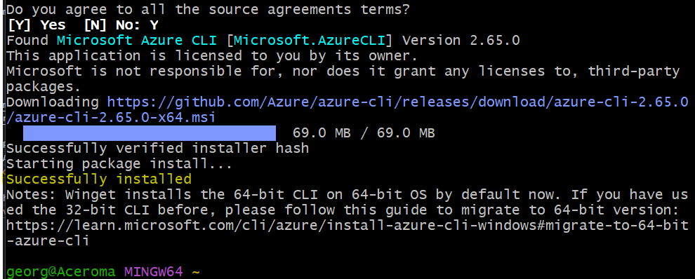
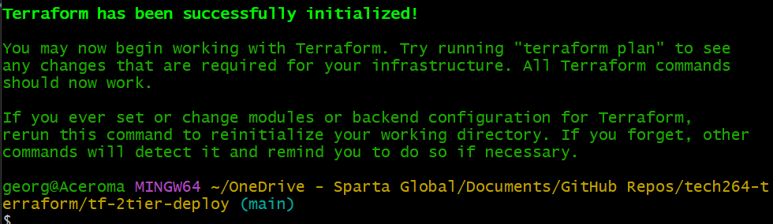

# Terraform Documentation
Source: https://developer.hashicorp.com/terraform/docs

# Task: Use Terraform to create a 2-tier deployment on Azure
* Create your own VNet with 2 subnets
  * Use the same CIDR blocks as you used when we created the 2-subnet VNet manually
* Create the app VM's NSG to allow ports 22, 80 and 3000
* Create the DB VM's NSG to allow:
  * SSH
  * Mongo DB from public-subnet CIDR block
  * Deny everything else
* Create the app-instance and db-instance in the VNet created by Terraform, and to use the NSGs created by Terraform

Helpful hints:
* Use the official documentation for Terraform
* Name things appropriately so that you know what you created with Terraform

Extra credit:
* Work out how we can get Terraform to add key to our EC2 instance
* Work out how to get user data to run on each of the VMs

<br>

# Install Azure CLI
Source: https://learn.microsoft.com/en-us/cli/azure/install-azure-cli-windows?tabs=azure-cli

## Via git Command / PowerShell
* You can use winget, Microsoft's Package manager for Windows, to install and manage updates for Azure CLI.
  * `winget install -e --id Microsoft.AzureCLI`
* The `-e` option is to ensure the official Azure CLI package is installed. This command installs the latest version by default.
  * To specify a version, add a `-v` <version> with your desired version to the command.




* Give it permission.




* You can now run the Azure CLI with the az command from either Windows Command Prompt or PowerShell.

<br>

> Make sure your folder in Gitbash has been 'terraform init' before you attempt a plan.
>
> cd > tf-2tier-deploy > terraform init



<br>

# 1. Create the VNet with Two Subnets
* In your Terraform configuration (main.tf), define an Azure Virtual Network (VNet) with two subnets. 
* Use the same CIDR blocks that you used earlier when creating the VNet manually (0.0.0.0/0).

```bash
provider "azurerm" {        # azurerm stands for Azure Resource Manager
  features {}
}

# Create a VNet
resource "azurerm_virtual_network" "tech264_georgia_vnet" {
  name                = "tech264_georgia_vnet"
  address_space       = ["10.0.0.0/16"]
  location            = "UK South"
  resource_group_name = "tech264_georgia_resource_group"
}

# Create two subnets within the VNet
resource "azurerm_subnet" "public_subnet" {
  name                 = "public-subnet"
  resource_group_name  = "tech264_georgia_resource_group"
  virtual_network_name = azurerm_virtual_network.tech264_georgia_vnet.name
  address_prefixes     = ["10.0.1.0/24"]
}

resource "azurerm_subnet" "private_subnet" {
  name                 = "private-subnet"
  resource_group_name  = "tech264_georgia_resource_group"
  virtual_network_name = azurerm_virtual_network.tech264_georgia_vnet.name
  address_prefixes     = ["10.0.2.0/24"]
}
```

# 2. Create NSGs for App VM and DB VM
* Define the Network Security Groups (NSGs) to control access to your app and database instances.

## 2.1 App VM NSG (allow ports 22, 80, 3000)
```bash
resource "azurerm_network_security_group" "tech264_georgia_app_nsg" {
  name                = "tech264_georgia_app-nsg"
  location            = "UK South"
  resource_group_name = "tech264_georgia_resource_group"

  security_rule {
    name                       = "allow_ssh"
    priority                   = 100
    direction                  = "Inbound"
    access                     = "Allow"
    protocol                   = "Tcp"
    source_port_range          = "*"
    destination_port_range     = "22"
    source_address_prefix      = "*"
    destination_address_prefix = "*"
  }

  security_rule {
    name                       = "allow_http"
    priority                   = 101
    direction                  = "Inbound"
    access                     = "Allow"
    protocol                   = "Tcp"
    source_port_range          = "*"
    destination_port_range     = "80"
    source_address_prefix      = "*"
    destination_address_prefix = "*"
  }

  security_rule {
    name                       = "allow_3000"
    priority                   = 102
    direction                  = "Inbound"
    access                     = "Allow"
    protocol                   = "Tcp"
    source_port_range          = "*"
    destination_port_range     = "3000"
    source_address_prefix      = "*"
    destination_address_prefix = "*"
  }
}

```

## 2.2 DB VM NSG (allow SSH and MongoDB, deny all else)
* 

```bash
resource "azurerm_network_security_group" "tech264_georgia_db_nsg" {
  name                = "tech264_georgia_db-nsg"
  location            = "UK South"
  resource_group_name = "tech264_georgia_resource_group"

  security_rule {
    name                       = "allow_ssh"
    priority                   = 100
    direction                  = "Inbound"
    access                     = "Allow"
    protocol                   = "Tcp"
    source_port_range          = "*"
    destination_port_range     = "22"
    source_address_prefix      = "*"
    destination_address_prefix = "*"
  }

  security_rule {
    name                       = "allow_mongo"
    priority                   = 101
    direction                  = "Inbound"
    access                     = "Allow"
    protocol                   = "Tcp"
    source_port_range          = "*"
    destination_port_range     = "27017"
    source_address_prefix      = azurerm_subnet.public_subnet.address_prefixes[0]  # Allow MongoDB only from public subnet
    destination_address_prefix = "*"
  }

  security_rule {
    name                       = "deny_all_inbound"
    priority                   = 200
    direction                  = "Inbound"
    access                     = "Deny"
    protocol                   = "*"
    source_port_range          = "*"
    destination_port_range     = "*"
    source_address_prefix      = "*"
    destination_address_prefix = "*"
  }
}
```

# 3. Create the VMs
* C*reate the App VM and DB VM, associating them with the VNet, subnets, and NSGs you created.

## 3.1 Create App VM
```bash
resource "azurerm_network_interface" "tech264_georgia_app_nic" {
  name                = "tech264_georgia_app_nic"
  location            = "UK South"
  resource_group_name = "tech264_georgia_resource_group"
  ip_configuration {
    name                          = "app-ip-config"
    subnet_id                     = azurerm_subnet.public_subnet.id
    private_ip_address_allocation = "Dynamic"
  }
}

resource "azurerm_virtual_machine" "app_instance" {
  name                  = "app-instance"
  location              = "East US"
  resource_group_name   = ""
  network_interface_ids = [azurerm_network_interface.app_nic.id]
  vm_size               = "Standard_B1s"

  # NSG association
  network_security_group_id = azurerm_network_security_group.app_nsg.id

  storage_os_disk {
    name              = "app_os_disk"
    caching           = "ReadWrite"
    create_option     = "FromImage"
    managed_disk_type = "Standard_LRS"
  }

  os_profile {
    computer_name  = "appvm"
    admin_username = "azureuser"
    admin_password = "P@ssw0rd1234"
  }

  os_profile_linux_config {
    disable_password_authentication = false
  }

  source_image_reference {
    publisher = "Canonical"
    offer     = "UbuntuServer"
    sku       = "18.04-LTS"
    version   = "latest"
  }
}

```

## 3.2 Create DB VM
```bash

```