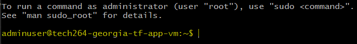

# Creating a 2-tier Deployment Using Terraform
Table of Contents
- [Creating a 2-tier Deployment Using Terraform](#creating-a-2-tier-deployment-using-terraform)
- [Azure CLI](#azure-cli)
  - [Why is the 'az login' necessary?](#why-is-the-az-login-necessary)
- ['az login' in Windows Powershell](#az-login-in-windows-powershell)
  - [Find subscription id](#find-subscription-id)
- [Terraform Documentation](#terraform-documentation)
- [Task: Use Terraform to create a 2-tier deployment on Azure](#task-use-terraform-to-create-a-2-tier-deployment-on-azure)
- [Install Azure CLI](#install-azure-cli)
  - [Via git Command / PowerShell](#via-git-command--powershell)
- [Initialise the folder](#initialise-the-folder)
- [Create Path for CLI](#create-path-for-cli)
  - [Add Credentials to Env Variables](#add-credentials-to-env-variables)
- [1. Create the VNet with Two Subnets](#1-create-the-vnet-with-two-subnets)
    - [What's going on in this block of code?](#whats-going-on-in-this-block-of-code)
  - [1.1 Create a VNet](#11-create-a-vnet)
    - [What's going on in this block of code?](#whats-going-on-in-this-block-of-code-1)
  - [1.2 Create a Public Subnet](#12-create-a-public-subnet)
    - [What's going on in this code block?](#whats-going-on-in-this-code-block)
  - [1.3 Create a Private Subnet](#13-create-a-private-subnet)
    - [What's going on in this code block?](#whats-going-on-in-this-code-block-1)
- [2. Create NSGs for App VM and DB VM](#2-create-nsgs-for-app-vm-and-db-vm)
  - [2.1 App VM NSG (allow ports 22, 80, 3000)](#21-app-vm-nsg-allow-ports-22-80-3000)
    - [What's going on in this code block?](#whats-going-on-in-this-code-block-2)
  - [2.2 DB VM NSG (allow SSH and MongoDB, deny all else)](#22-db-vm-nsg-allow-ssh-and-mongodb-deny-all-else)
    - [What's going on in this code block?](#whats-going-on-in-this-code-block-3)
- [3. Create a Public IP Address Resource](#3-create-a-public-ip-address-resource)
    - [What's going on in this code block?](#whats-going-on-in-this-code-block-4)
- [3.1 Create a Network Interface for App VM](#31-create-a-network-interface-for-app-vm)
    - [What's going on in this code block?](#whats-going-on-in-this-code-block-5)
- [4. Create the VMs](#4-create-the-vms)
  - [4.1 Create App VM](#41-create-app-vm)
    - [What's going on in this code block?](#whats-going-on-in-this-code-block-6)
  - [4.2 Network Security Group Association for App VM](#42-network-security-group-association-for-app-vm)
    - [What's going on in this code block?](#whats-going-on-in-this-code-block-7)
- [5. Create a Network Interface for Database VM](#5-create-a-network-interface-for-database-vm)
    - [What's going on in this code block?](#whats-going-on-in-this-code-block-8)
  - [5.1 Create DB VM](#51-create-db-vm)
    - [What's going on in this block of code?](#whats-going-on-in-this-block-of-code-2)
  - [5.2 NSG association for DB VM](#52-nsg-association-for-db-vm)
    - [What's going on in this code block?](#whats-going-on-in-this-code-block-9)
- [Notes on User Data, SSH Key, and Source Image](#notes-on-user-data-ssh-key-and-source-image)
  - [User Data for VM Setup](#user-data-for-vm-setup)
  - [Add an SSH Key to the EC2 Instance](#add-an-ssh-key-to-the-ec2-instance)
  - [Source Image](#source-image)
- [Go to Azure to see if your VMs have been created](#go-to-azure-to-see-if-your-vms-have-been-created)
- [Can you SSH into the App?](#can-you-ssh-into-the-app)
  - [Can you get onto the app page? ✅](#can-you-get-onto-the-app-page-)
  - [Can you get to the posts page?](#can-you-get-to-the-posts-page)
- [Task: Setup your repo to use Azure blob storage for state file management](#task-setup-your-repo-to-use-azure-blob-storage-for-state-file-management)

<br>

# Azure CLI
* When using Terraform to create resources in Azure, you need to authenticate with Azure to gain access to your subscription and manage resources. 
* The `az login` command is used to authenticate your Azure CLI session with your Azure account. 

## Why is the 'az login' necessary?
* **Authentication**: az login ensures that Terraform has the necessary permissions to create, modify, and delete resources in your Azure subscription. 
  * Without authentication, Terraform cannot interact with Azure services.
* **Security**: By logging in, you ensure that only authorized users can make changes to your Azure environment. 
  * This helps maintain the security and integrity of your infrastructure.
* **Session Management**: The Azure CLI manages your session and tokens, making it easier to handle authentication across multiple Terraform runs. 
  * This avoids the need to manually handle tokens or credentials.
* **Integration**: Terraform uses the Azure CLI to interact with Azure Resource Manager (ARM) APIs. 
  * Logging in via az login allows Terraform to leverage the CLI’s capabilities for resource management.

<br>

# 'az login' in Windows Powershell
* When I tried to `terraform plan` within GitBash, I recieved an error about how I need authorisation via Azure CLI. 


* Go to Windows Powershell and `az login`.
* Click "Workplace or school account" and enter the email you used on Azure.


* Don't worry about this error.
* Click "Done" anyway.


* Select your subscription ID from the provided list. 
* In this case, enter "1" where prompted. 


<br>

## Find subscription id
* In the Windows Powershell, type `az account show`. This will show you more details about your account. 
* Under "id", take note of this as you will use this as your subscription id within the main.tf file. 


<br>

# Terraform Documentation
Source: https://developer.hashicorp.com/terraform/docs

<br>

# Task: Use Terraform to create a 2-tier deployment on Azure
* Create your own VNet with 2 subnets
  * Use the same CIDR blocks as you used when we created the 2-subnet VNet manually
* Create the app VM's NSG to allow ports 22, 80 and 3000
* Create the DB VM's NSG to allow:
  * SSH
  * Mongo DB from public-subnet CIDR block
  * Deny everything else
* Create the app-instance and db-instance in the VNet created by Terraform, and to use the NSGs created by Terraform

Helpful hints:
* Use the official documentation for Terraform
* Name things appropriately so that you know what you created with Terraform

Extra credit:
* Work out how we can get Terraform to add key to our EC2 instance
* Work out how to get user data to run on each of the VMs

<br>

# Install Azure CLI
Source: https://learn.microsoft.com/en-us/cli/azure/install-azure-cli-windows?tabs=azure-cli

## Via git Command / PowerShell
* You can use winget, Microsoft's Package manager for Windows, to install and manage updates for Azure CLI.
* You can do this via Windows Powershell or through the GitBash Terminal. 
  * `winget install -e --id Microsoft.AzureCLI`
* The `-e` option is to ensure the official Azure CLI package is installed. This command installs the latest version by default.
  * To specify a version, add a `-v` <version> with your desired version to the command.


* Here, I've used the command in the GitBash Terminal.


* Give it permission.


* You can now run the Azure CLI with the az command from either Windows Command Prompt or PowerShell.

<br>

# Initialise the folder
* Create `main.tf` file. 
* Make sure your folder in Gitbash has been 'terraform init' before you attempt a plan.
  * cd > tech264-terraform > cd tf-2tier-deploy > terraform init


<br>

# Create Path for CLI
* Windows Powershell > check the version of Azure CLI with `az --version` to make sure you have the latest installed and there's no need for updates/upgrades. 


* Obtain the path so you can add it as an environment variable: C:\Users\georg\.azure\cliextensions

<br>

## Add Credentials to Env Variables
* Windows Search Bar > "Edit environment variables"
* Advanced > entironment variables. 


* Click on "Path" and edit.
* Add the path to Azure folder. 


* Check on new GitBash Window if the CLI is up to date.


<br>

# 1. Create the VNet with Two Subnets
* In your Terraform configuration (main.tf), define an Azure Virtual Network (VNet) with two subnets. 
  * Use the same CIDR blocks that you used earlier when creating the VNet manually (0.0.0.0/0).

<br> 

```bash
provider "azurerm" {  # Azure Resource Manager
  features {}
  use_cli                         = true
  subscription_id                 = var.subscription_id
  resource_provider_registrations = "none"
}
```

<br> 

### What's going on in this block of code?

* `provider "azurerm"`: This specifies that the AzureRM provider will be used. 
  * The AzureRM provider is responsible for interacting with Azure’s Resource Manager API.

* `features {}`: This block is required but can be left empty.
  * It enables the provider to use all the default features.

* `use_cli` = true: This setting tells Terraform to use the Azure CLI for authentication. 
  * This means you need to be logged in to Azure CLI (az login) for Terraform to authenticate and manage resources.

* `subscription_id = var.subscription_id`: This sets the subscription ID for the Azure account. 
  * The value is taken from a variable named subscription_id, which should be defined elsewhere in your Terraform configuration.

* `resource_provider_registrations = "none"`: This setting prevents Terraform from automatically registering resource providers. 
  * This is useful if the user or service principal running Terraform does not have the necessary permissions to register resource providers.

This configuration is useful for managing Azure resources securely and efficiently, especially in environments where permissions are tightly controlled.

<br>

## 1.1 Create a VNet
```bash
resource "azurerm_virtual_network" "tech264_georgia_vnet" {
  name                = "tech264_georgia_vnet"
  address_space       = ["10.0.0.0/16"]
  location            = "UK South"
  resource_group_name = "tech264"
}
```

<br>

### What's going on in this block of code?

This Terraform code block creates a Virtual Network (VNet) in Azure. 

* `resource "azurerm_virtual_network" "tech264_georgia_vnet"`: This line defines a new resource of type azurerm_virtual_network with the name tech264_georgia_vnet. 
  * The azurerm_virtual_network resource is used to manage a virtual network in Azure.

* `name = "tech264_georgia_vnet"`: This sets the name of the virtual network to tech264_georgia_vnet.

* `address_space = ["10.0.0.0/16"]`: This specifies the address space for the virtual network. 
  * In this case, the VNet will use the IP range 10.0.0.0/16.

* `location = "UK South"`: This sets the location (or region) where the virtual network will be created. Here, it is set to UK South.

* `resource_group_name = "tech264"`: This specifies the name of the resource group in which the virtual network will be created. The resource group is named tech264.

This configuration creates a virtual network named tech264_georgia_vnet in the UK South region, within the tech264 resource group, and assigns it the address space 10.0.0.0/16.


<br>

## 1.2 Create a Public Subnet
```bash
resource "azurerm_subnet" "public_subnet" {
  name                 = "public-subnet"
  resource_group_name  = "tech264"
  virtual_network_name = azurerm_virtual_network.tech264_georgia_vnet.name
  address_prefixes     = ["10.0.1.0/24"]
}
```

<br>

### What's going on in this code block?

This Terraform code block creates a subnet within an existing virtual network in Azure. 

* `resource "azurerm_subnet" "public_subnet"`: This line defines a new resource of type azurerm_subnet with the name public_subnet. 
  * The azurerm_subnet resource is used to manage subnets within a virtual network in Azure.

* `name = "public-subnet"`: This sets the name of the subnet to public-subnet.

* `resource_group_name = "tech264"`: This specifies the name of the resource group in which the subnet will be created. The resource group is named tech264.

* `virtual_network_name = azurerm_virtual_network.tech264_georgia_vnet.name`: This sets the name of the virtual network to which the subnet will belong. 
  * It references the name of the virtual network defined earlier in the configuration (tech264_georgia_vnet).

* `address_prefixes = ["10.0.1.0/24"]`: This specifies the address range for the subnet. In this case, the subnet will use the IP range 10.0.1.0/24.

This configuration creates a subnet named public-subnet within the tech264 resource group, inside the tech264_georgia_vnet virtual network, and assigns it the address range 10.0.1.0/24.


<br>

## 1.3 Create a Private Subnet
```bash
resource "azurerm_subnet" "private_subnet" {
  name                 = "private-subnet"
  resource_group_name  = "tech264"
  virtual_network_name = azurerm_virtual_network.tech264_georgia_vnet.name
  address_prefixes     = ["10.0.2.0/24"]
}
```

<br>

### What's going on in this code block?
This Terraform code block creates a private subnet within an existing virtual network in Azure. Here’s a detailed breakdown:

* `resource "azurerm_subnet" "private_subnet"`: This line defines a new resource of type azurerm_subnet with the name private_subnet. The azurerm_subnet resource is used to manage subnets within a virtual network in Azure.

* `name = "private-subnet"`: This sets the name of the subnet to private-subnet.

* `resource_group_name = "tech264"`: This specifies the name of the resource group in which the subnet will be created. The resource group is named tech264.

* `virtual_network_name = azurerm_virtual_network.tech264_georgia_vnet.name`: This sets the name of the virtual network to which the subnet will belong. It references the name of the virtual network defined earlier in the configuration (tech264_georgia_vnet).

* `address_prefixes = ["10.0.2.0/24"]`: This specifies the address range for the subnet. In this case, the subnet will use the IP range 10.0.2.0/24.

This configuration creates a subnet named private-subnet within the tech264 resource group, inside the tech264_georgia_vnet virtual network, and assigns it the address range 10.0.2.0/24.

<br>

# 2. Create NSGs for App VM and DB VM
* Define the Network Security Groups (NSGs) to control access to your app and database instances.

## 2.1 App VM NSG (allow ports 22, 80, 3000)
```bash
# App VM NSG (allow ports 22, 80, 3000)
resource "azurerm_network_security_group" "tech264_georgia_app_nsg" {
  name                = "tech264_georgia_app_nsg"
  location            = "UK South"
  resource_group_name = "tech264"

  # Security rule: 22/allow ssh
  security_rule {
    name                       = "allow_ssh"
    priority                   = 100
    direction                  = "Inbound"
    access                     = "Allow"
    protocol                   = "Tcp"
    source_port_range          = "*"
    destination_port_range     = "22"
    source_address_prefix      = "*"
    destination_address_prefix = "*"
  }

  # Security rule: 80/allow http
  security_rule {
    name                       = "allow_http"
    priority                   = 101
    direction                  = "Inbound"
    access                     = "Allow"
    protocol                   = "Tcp"
    source_port_range          = "*"
    destination_port_range     = "80"
    source_address_prefix      = "*"
    destination_address_prefix = "*"
  }

  # Security rule: 3000
  security_rule {
    name                       = "allow_3000"
    priority                   = 102
    direction                  = "Inbound"
    access                     = "Allow"
    protocol                   = "Tcp"
    source_port_range          = "*"
    destination_port_range     = "3000"
    source_address_prefix      = "*"
    destination_address_prefix = "*"
  }
}
```

<br>

### What's going on in this code block?
* **Resource Definition**: The code defines a Network Security Group (NSG) named tech264_georgia_app_nsg in the “UK South” location, within the “tech264” resource group.

* **Security Rules**: The NSG includes three inbound security rules:
  * **SSH Rule**: Allows TCP traffic on port 22 (SSH) from any source to any destination.
  * **HTTP Rule**: Allows TCP traffic on port 80 (HTTP) from any source to any destination.
  * **Custom Rule**: Allows TCP traffic on port 3000 from any source to any destination.

<br>

## 2.2 DB VM NSG (allow SSH and MongoDB, deny all else)
* 

```bash
# DB VM NSG (allow SSH and MongoDB, deny all else)
resource "azurerm_network_security_group" "tech264_georgia_db_nsg" {
  name                = "tech264_georgia_db_nsg"
  location            = "UK South"
  resource_group_name = "tech264"

  # Security rule: 22/allow ssh
  security_rule {
    name                       = "allow_ssh"
    priority                   = 100
    direction                  = "Inbound"
    access                     = "Allow"
    protocol                   = "Tcp"
    source_port_range          = "*"
    destination_port_range     = "22"
    source_address_prefix      = "*"
    destination_address_prefix = "*"
  }

  # Security rule: 27017/allow Mongo
  security_rule {
    name                       = "allow_mongo"
    priority                   = 101
    direction                  = "Inbound"
    access                     = "Allow"
    protocol                   = "Tcp"
    source_port_range          = "*"
    destination_port_range     = "27017"
    source_address_prefix      = "10.0.1.0/24" # CIDR of the public subnet
    destination_address_prefix = "*"
  }

  # Security rule: deny everything else (imbound traffic)
  security_rule {
    name                       = "deny_all_inbound"
    priority                   = 200
    direction                  = "Inbound"
    access                     = "Deny"
    protocol                   = "*"
    source_port_range          = "*"
    destination_port_range     = "*"
    source_address_prefix      = "*"
    destination_address_prefix = "*"
  }
}
```

<br>

### What's going on in this code block?
* **Resource Definition**
  * Creates a Network Security Group (NSG) named tech264_georgia_db_nsg in the “UK South” region, within the “tech264” resource group.

* **Security Rules**
  * **SSH Rule**: Allows inbound TCP traffic on port 22 (SSH) from any source.
  * **MongoDB Rule**: Allows inbound TCP traffic on port 27017 (MongoDB) from the subnet 10.0.1.0/24.
  * **Deny All Else**: Denies all other inbound traffic.

This setup ensures that only SSH and MongoDB traffic is allowed, while all other inbound traffic is blocked.

<br>

# 3. Create a Public IP Address Resource
```bash
resource "azurerm_public_ip" "app_vm_public_ip" {
  name                = "app_vm_public_ip"
  location            = "UK South"
  resource_group_name = "tech264"
  allocation_method   = "Static"
}
```

<br>

### What's going on in this code block?
This code block is creating a Public IP Address resource in Azure using Terraform. 

* **Resource Definition**
  * **Type**: `azurerm_public_ip` - This specifies that the resource being created is a public IP address.
  * **Name**: `app_vm_public_ip` - This is the internal name used to reference this resource within the Terraform configuration.

* **Properties**
  * **name**: `app_vm_public_ip` - The name of the public IP address resource.
  * **location**: `UK South` - The Azure region where the resource will be created.
  * **resource_group_name**: `tech264` - The name of the resource group in which this public IP address will be placed.
  * **allocation_method**: `Static` - This specifies that the public IP address will be static, meaning it will not change once assigned.

This setup ensures that a static public IP address is created in the specified region and resource group.

<br>

# 3.1 Create a Network Interface for App VM
```bash
# Create Network Interface for App VM
resource "azurerm_network_interface" "tech264_georgia_app_nic" {
  name                = "tech264_georgia_app_nic"
  location            = "UK South"
  resource_group_name = "tech264"

  ip_configuration {
    name                          = "internal"
    subnet_id                     = azurerm_subnet.public_subnet.id
    private_ip_address_allocation = "Dynamic"
    public_ip_address_id          = azurerm_public_ip.app_vm_public_ip.id
  }
}
```

<br>

### What's going on in this code block?
This code block is creating a Network Interface (NIC) for an application virtual machine (VM) in Azure using Terraform. 

* **Resource Definition**
  * **Type**: `azurerm_network_interface` - This specifies that the resource being created is a network interface.
  * **Name**: `tech264_georgia_app_nic` - The internal name used to reference this resource within the Terraform configuration.

* **Properties**
  * **name**: `tech264_georgia_app_nic` - The name of the network interface.
  * **location**: `UK South` - The Azure region where the resource will be created.
  * **resource_group_name**: `tech264` - The name of the resource group in which this network interface will be placed.

* **IP Configuration**
  * **name**: `internal` - The name of the IP configuration.
  * **subnet_id**: `azurerm_subnet.public_subnet.id` - The ID of the subnet to which this network interface will be connected.
  * **private_ip_address_allocation**: `Dynamic` - The private IP address will be dynamically assigned.
  * **public_ip_address_id**: `azurerm_public_ip.app_vm_public_ip.id` - The ID of the public IP address associated with this network interface.

This setup ensures that the network interface is properly configured with both a dynamic private IP address and a static public IP address, allowing the VM to communicate within the virtual network and with external resources.

<br>

# 4. Create the VMs
* Create the App VM and DB VM, associating them with the VNet, subnets, and NSGs you created.

## 4.1 Create App VM
```bash
# Create App VM
resource "azurerm_linux_virtual_machine" "app_vm" {
  name                            = "tech264-georgia-tf-app-vm"
  location                        = "UK South"
  resource_group_name             = "tech264"
  size                            = "Standard_B1s"
  admin_username                  = "adminuser"
  network_interface_ids           = [azurerm_network_interface.tech264_georgia_app_nic.id]
  disable_password_authentication = true

  # Add SSH Key
  admin_ssh_key {
    username   = "adminuser"
    public_key = file(var.admin_public_key_path) # Path to your SSH public key
  }

  # Add User Data
  user_data = filebase64(var.user_data_script_path) # Path to your script

  os_disk {
    caching              = "ReadWrite"
    storage_account_type = "Standard_LRS"
  }

  source_image_id = var.source_image_id
}
```

<br>

### What's going on in this code block?
This code block is creating a Linux virtual machine (VM) in Azure using Terraform.

* **Resource Definition**
  * **Type**: `azurerm_linux_virtual_machine` - Specifies that the resource being created is a Linux VM.
  * **Name**: `app_vm` - The internal name used to reference this resource within the Terraform configuration.

* **Properties**
  * **name**: `tech264-georgia-tf-app-vm` - The name of the VM.
  * **location**: `UK South` - The Azure region where the VM will be created.
  * **resource_group_name**: `tech264` - The name of the resource group in which this VM will be placed.
  * **size**: `Standard_B1s` - The size of the VM, which determines its compute resources.
  * **admin_username**: `adminuser` - The username for the VM’s administrator account.
  * **network_interface_ids**: `[azurerm_network_interface.tech264_georgia_app_nic.id]` - The ID of the network interface associated with this VM.
  * **disable_password_authentication**: `true` - Disables password authentication, requiring SSH key authentication instead.

* **SSH Key Configuration**
  * **username**: `adminuser` - The username for SSH access.
  * **public_key**: `file(var.admin_public_key_path)` - The path to the SSH public key file.

* **User Data**
  * **user_data**: `filebase64(var.user_data_script_path)` - The path to a script that will be executed when the VM starts, encoded in base64.

* **OS Disk Configuration**
  * **caching**: `ReadWrite` - The caching mode for the OS disk.
  * **storage_account_type**: `Standard_LRS` - The type of storage account for the OS disk.

* **Source Image**
  * **source_image_id**: `var.source_image_id` - The ID of the source image used to create the VM.

This setup ensures that a Linux VM is created with the specified configurations, including network settings, SSH key authentication, and initial setup scripts.

<br>

## 4.2 Network Security Group Association for App VM
```bash
# NSG association for App VM
resource "azurerm_network_interface_security_group_association" "nic_nsg_association" {
  network_interface_id      = azurerm_network_interface.tech264_georgia_app_nic.id
  network_security_group_id = azurerm_network_security_group.tech264_georgia_app_nsg.id
}
```

<br>

### What's going on in this code block?
This code block is associating a Network Security Group (NSG) with a Network Interface (NIC) for an application virtual machine (VM) in Azure using Terraform. 

* **Resource Definition**
* **Type**: `azurerm_network_interface_security_group_association` - Specifies that the resource being created is an association between a network interface and a network security group.
* **Name**: `nic_nsg_association` - The internal name used to reference this resource within the Terraform configuration.

* **Properties**
  * **network_interface_id**: `azurerm_network_interface.tech264_georgia_app_nic.id` - The ID of the network interface (tech264_georgia_app_nic) that will be associated with the NSG.
  * **network_security_group_id**: `azurerm_network_security_group.tech264_georgia_app_nsg.id` - The ID of the network security group (tech264_georgia_app_nsg) that will be associated with the network interface.

This setup ensures that the specified network security group is applied to the network interface, thereby enforcing the security rules defined in the NSG on the traffic to and from the network interface.


<br>

# 5. Create a Network Interface for Database VM
```bash
# Create Network Interface for DB VM
resource "azurerm_network_interface" "tech264_georgia_db_nic" {
  name                = "tech264_georgia_db_nic"
  location            = "UK South"
  resource_group_name = "tech264"
  ip_configuration {
    name                          = "db-ip-config"
    subnet_id                     = azurerm_subnet.private_subnet.id
    private_ip_address_allocation = "Dynamic"
  }
}
```

<br>

### What's going on in this code block?
This code block is creating a Network Interface (NIC) for a database virtual machine (VM) in Azure using Terraform. 

* **Resource Definition**
  * **Type**: `azurerm_network_interface` - Specifies that the resource being created is a network interface.
  * **Name**: `tech264_georgia_db_nic` - The internal name used to reference this resource within the Terraform configuration.

* **Properties**
  * **name**: `tech264_georgia_db_nic` - The name of the network interface.
  * **location**: `UK South` - The Azure region where the resource will be created.
  * **resource_group_name**: `tech264` - The name of the resource group in which this network interface will be placed.

* **IP Configuration**
  * **name**: `db-ip-config` - The name of the IP configuration.
  * **subnet_id**: `azurerm_subnet.private_subnet.id` - The ID of the subnet to which this network interface will be connected.
  * **private_ip_address_allocation**: `Dynamic` - The private IP address will be dynamically assigned.

This setup ensures that the network interface is properly configured with a dynamic private IP address within the specified subnet, allowing the database VM to communicate within the virtual network.

<br>

## 5.1 Create DB VM
```bash
# Create a DB VM
resource "azurerm_linux_virtual_machine" "db_vm" {
  name                            = "tech264-georgia-tf-db-vm"
  location                        = "UK South"
  resource_group_name             = "tech264"
  size                            = "Standard_B1s"
  admin_username                  = "adminuser"
  network_interface_ids           = [azurerm_network_interface.tech264_georgia_db_nic.id]
  disable_password_authentication = true

  # Add SSH Key
  admin_ssh_key {
    username   = "adminuser"
    public_key = file(var.admin_public_key_path) # Path to your SSH public key
  }

  # Add User Data
  user_data = filebase64(var.database_user_data_script_path) # Path to your script


  os_disk {
    caching              = "ReadWrite"
    storage_account_type = "Standard_LRS"
  }

  source_image_id = var.db_source_image_id
}
```

<br>

### What's going on in this block of code?
This code block is creating a Linux virtual machine (VM) for a database in Azure using Terraform. 

* **Resource Definition**
  * **Type**: `azurerm_linux_virtual_machine` - Specifies that the resource being created is a Linux VM.
  * **Name**: `db_vm` - The internal name used to reference this resource within the Terraform configuration.

* **Properties**
  * **name**: `tech264-georgia-tf-db-vm` - The name of the VM.
  * **location**: `UK South` - The Azure region where the VM will be created.
  * **resource_group_name**: `tech264` - The name of the resource group in which this VM will be placed.
  * **size**: `Standard_B1s` - The size of the VM, which determines its compute resources.
  * **admin_username**: `adminuser` - The username for the VM’s administrator account.
  * **network_interface_ids**: `[azurerm_network_interface.tech264_georgia_db_nic.id]` - The ID of the network interface associated with this VM.
  * **disable_password_authentication**: `true` - Disables password authentication, requiring SSH key authentication instead.

* **SSH Key Configuration**
  * **username**: `adminuser` - The username for SSH access.
  * **public_key**: `file(var.admin_public_key_path)` - The path to the SSH public key file.

* **User Data**
  * **user_data**: `filebase64(var.database_user_data_script_path)` - The path to a script that will be executed when the VM starts, encoded in base64.

* **OS Disk Configuration**
  * **caching**: `ReadWrite` - The caching mode for the OS disk.
  * **storage_account_type**: `Standard_LRS` - The type of storage account for the OS disk.

* **Source Image**
  * **source_image_id**: `var.db_source_image_id` - The ID of the source image used to create the VM.

This setup ensures that a Linux VM is created with the specified configurations, including network settings, SSH key authentication, and initial setup scripts.

<br>

## 5.2 NSG association for DB VM
```bash
# NSG association for DB VM
resource "azurerm_network_interface_security_group_association" "db_nic_nsg_association" {
  network_interface_id      = azurerm_network_interface.tech264_georgia_db_nic.id
  network_security_group_id = azurerm_network_security_group.tech264_georgia_db_nsg.id
}
```

<br>

### What's going on in this code block?
This code block is associating a Network Security Group (NSG) with a Network Interface (NIC) for a database virtual machine (VM) in Azure using Terraform. 

* **Resource Definition**
  * **Type**: `azurerm_network_interface_security_group_association` - Specifies that the resource being created is an association between a network interface and a network security group.
  * **Name**: `db_nic_nsg_association` - The internal name used to reference this resource within the Terraform configuration.

* **Properties**
  * **network_interface_id**: `azurerm_network_interface.tech264_georgia_db_nic.id` - The ID of the network interface (tech264_georgia_db_nic) that will be associated with the NSG.
  * **network_security_group_id**: `azurerm_network_security_group.tech264_georgia_db_nsg.id` - The ID of the network security group (tech264_georgia_db_nsg) that will be associated with the network interface.

This setup ensures that the specified network security group is applied to the network interface, thereby enforcing the security rules defined in the NSG on the traffic to and from the network interface.

<br>

# Notes on User Data, SSH Key, and Source Image

## User Data for VM Setup
* To run scripts on the VMs during provisioning (such as installing software), use custom data.
* Within main.tf, I have created a variable (see variable.tf file), for each the app and db script that I know works from previous VMs I've created. 
* Each variable contains the path to the working bash scripts.
  * These have also been copied into the 'tf-2tier-deploy' folder within tech264-terraform repo. 

## Add an SSH Key to the EC2 Instance 
* To add an SSH key to the VM, modify the os_profile block.
* I've chosen to have an SSH Key in both the app VM and the db VM.
* Within main.tf, I have created a variable (see variable.tf file), for each the SSH Keys. 
  * Each variable contains the path to the .ssh key.pub to enable you to SSH in via the Azure portal. 

## Source Image
* Add a `source_image_id` and as value you need the id of your images (app and db). 
  * You can find the image id by going to your image > settings > properties > resource id.

 
 

<br>

# Go to Azure to see if your VMs have been created
* Go to Azure > Virtual Machines > search for your VM. e.g., "georgia". 


<br>

# Can you SSH into the App?
* Go to Azure > Virtual Machines.
* Click on your app VM > "Connect" > Native SSH.
* Paste link into .ssh folder on GitBash. 



<br>

## Can you get onto the app page? ✅


<Br>

## Can you get to the posts page? 
* -no. ❌
  * check mongodb ip address on prov-app.sh script: db private IP: 10.0.2.4 (to match the db vm created on Azure). 
* Can you get to the posts page? -yes! ✅


<br>

> terraform destroy when you're done!

<br>

# Task: Setup your repo to use Azure blob storage for state file management
* Use a Terraform folder for the backend setup
* Use a Terraform separate folder for the main architecture (to deploy the app) which uses the backend setup for state file management

Deliverables:
* In the one Teams message in the main chat, paste links:
  * to your app running which was deployed by Terraform using remote state file management on Azure
  * a link to where your state files are stored in blob storage on the Azure portal (NOT the URL to the state files as they should NEVER be made public)
* Link to your documentation pasted into the main chat around COB