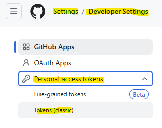
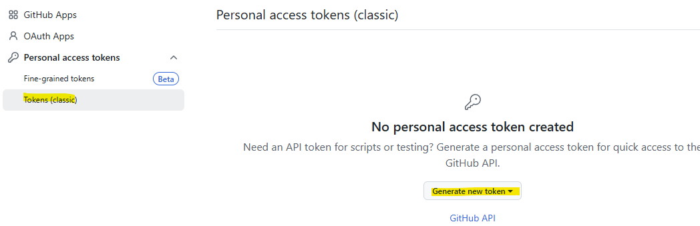
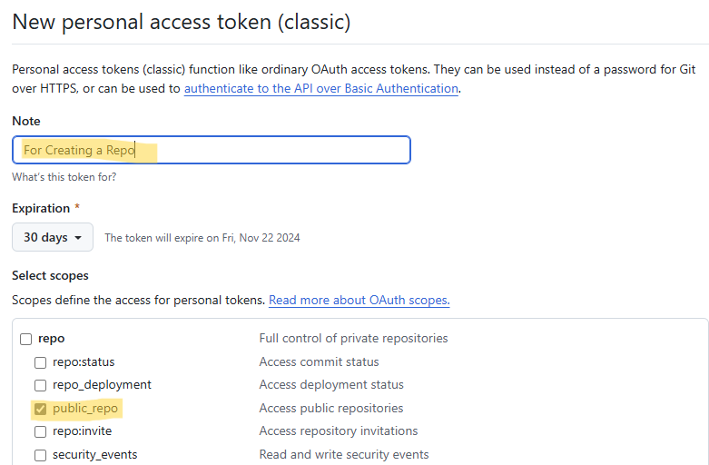
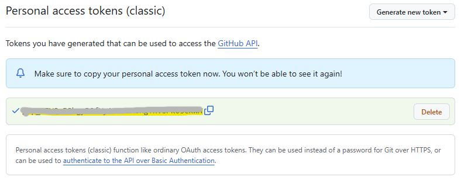
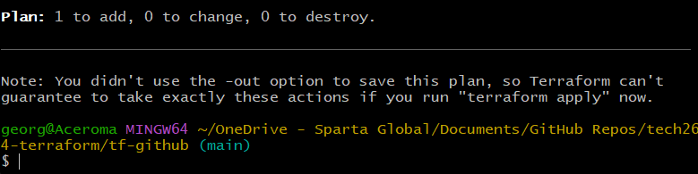
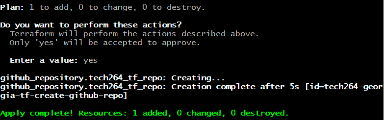
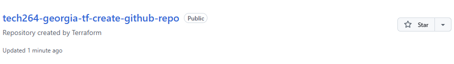

# Table of Contents
- [Table of Contents](#table-of-contents)
- [Task: Use Terraform to create a repo on GitHub](#task-use-terraform-to-create-a-repo-on-github)
  - [Set Up Authentication](#set-up-authentication)
  - [Create main.tf to Define the GitHub Repo and variables.tf](#create-maintf-to-define-the-github-repo-and-variablestf)
    - [main.tf](#maintf)
    - [variable.tf](#variabletf)
  - [Create a .gitignore File:](#create-a-gitignore-file)
  - [Authentication from GitHub? How will Terraform be given permission?](#authentication-from-github-how-will-terraform-be-given-permission)
- [Terraform.tfvars](#terraformtfvars)
  - [Benefits of Using terraform.tfvars](#benefits-of-using-terraformtfvars)
  - [Initialise Terraform](#initialise-terraform)
  - [Format \& Plan](#format--plan)
  - [Check your repo!](#check-your-repo)


# Task: Use Terraform to create a repo on GitHub
Goal: Automate the process of creating a repo on GitHub

* Create a new repo on your GitHub called tech2xx-tf-create-github-repo
* Add main.tf to create a public repo on GitHub
* Create .gitignore and variables as required/needed

You will need to work out:
* Authentication from GitHub? How will Terraform be given permission?
* You could use AI to help you on "how to create a GitHub repo using Terraform"

<br>

## Set Up Authentication
* To authenticate Terraform with GitHub, you will need to use a GitHub Personal Access Token. 
  * This token will allow Terraform to interact with the GitHub API.

Steps to Create a Personal Access Token:
1. Go to your GitHub Personal Access Tokens settings.
   1. At the bottom of the left hand side, you will see "Developer Settings".



1. Click Generate new token.



1. Give the token a name and select the scopes you need. For creating a repo, select the repo and public_repo scope.



1. Generate the token and copy it (you’ll need it for Terraform).


* Make sure you copy the link as you won't see it again. 


<br>

## Create main.tf to Define the GitHub Repo and variables.tf 
* Create a Terraform configuration file (main.tf) that will define the GitHub repository you want to create.

### main.tf
```bash
provider "github" {
  token = var.github_token # Reference the token from variables
}

resource "github_repository" "tech264_tf_repo" {
  name        = "tech264-georgia-tf-create-github-repo" # Repository name
  description = "Repository created by Terraform"
  visibility  = "public" # Set to "private" if you want a private repo
}
```

### variable.tf
```bash
variable "github_token" {
  type        = string
  description = "The GitHub Personal Access Token"
  sensitive   = true
}
```


## Create a .gitignore File:
* Create a `.gitignore` file to ensure you don’t accidentally commit sensitive information (like your access token).
* Use a variables.tf file to define the GitHub token as a variable. This keeps your token out of the main configuration files.

## Authentication from GitHub? How will Terraform be given permission?
* `terraform.tfvars`
  * Store the actual token value in a separate file (not to be shared publicly).


<br>

# Terraform.tfvars
* The terraform.tfvars file is used to **set variable values in Terraform configurations**. 
* It helps **manage** and **organise** your configuration by **separating variable definitions from their values**. 

<br>

## Benefits of Using terraform.tfvars
* **Separation of Concerns**: By keeping variable values in a separate file, you can maintain a clear distinction between your configuration logic and the specific values you use. 
  * This makes your configuration cleaner and easier to manage.

* **Reusability**: You can reuse the same Terraform configuration with different sets of values by simply changing the terraform.tfvars file. 
  * This is particularly useful for managing different environments (e.g., development, staging, production).

* **Security**: Sensitive information, such as API keys or passwords, can be stored in the terraform.tfvars file and kept out of your main configuration files. 
  * You can then add terraform.tfvars to your .gitignore file to ensure it is not committed to version control.

* **Ease of Management**: It simplifies the process of updating variable values. 
  * Instead of modifying the main configuration files, you can just update the terraform.tfvars file.

<br>

## Initialise Terraform
* Go into the repo directory containing the 'main.tf' file that you want to initialise.
* `terraform init`. 
* This initialises the directory and downloads the necessary provider plugins (in this case, for GitHub).


<br>

## Format & Plan
* `terraform fmt`: to format your code. 
* `terraform plan`: to see if your code is eligible. 



* `terraform apply`: to create your new repo!




## Check your repo!
* Go to GitHub > Repositorys. 


